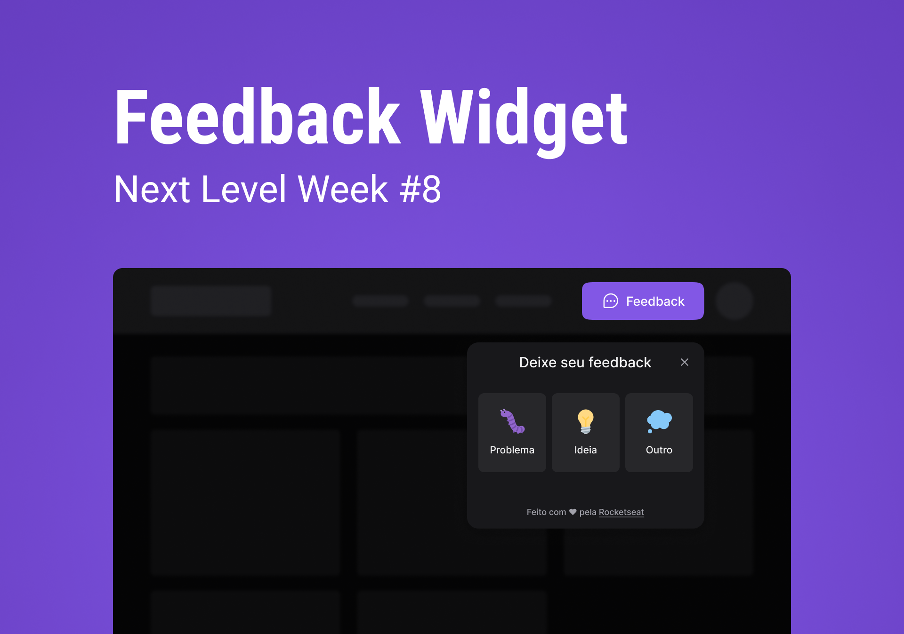

<h1 align="center">Feedback Widget</h1>

  

## 💻 Projeto

O Feedback Widget é um projeto que pode ser adicionado à algum site/app para coletar feedbacks dos usuários.
Foi desenvolvido juntamente com a equipe da [Rocketseat](https://www.rocketseat.com.br/) na trilha Impulse do evento NLW Return.

## 🚀 Tecnologias

Este projeto foi desenvolvido com as seguintes tecnologias:

- [Node.js](https://nodejs.org/en/)
- [React](https://reactjs.org/)
- [React Native](https://facebook.github.io/react-native/)
- [Expo](https://expo.io/)
- [Typescript](https://www.typescriptlang.org/)
- [Tailwind](https://tailwindcss.com/)

## Licença

Este projeto está sob a licença do MIT. Consulte a [LICENÇA](https://github.com/jordane-chaves/nlw-return-impulse/blob/main/LICENSE) para obter mais informações.

## Autor

 

Feito com 💜 por Jordane Chaves
